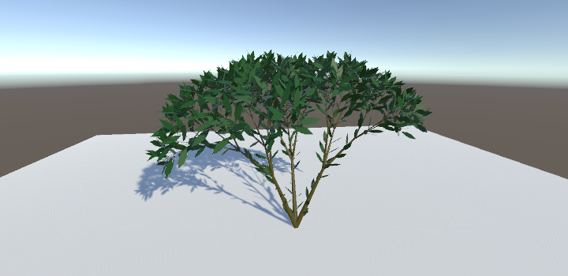

# Unity.ProceduralPlant

Procedural Plant Implementation for Unity Based on "[The Algorithm Beauty of Plants](http://algorithmicbotany.org/papers/abop/abop.pdf)"

## Quick Start

1. Add a package from the following git URL:

```
git@github.com:9087/Unity.ProceduralPlant.git
```

2. Create an empty GameObject.

3. Add the `Plant` component to the empty GameObject. (The MeshFilter and MeshRenderer will be automatically required.)

4. Set an available material (e.g. `Default-Material`) to the MeshRenderer.

5. Click the `Templates` button to select a default "plant", or try adjusting properties on the `Plant` to create various types of plants!

## Examples

**Plant-like structure**


```
n = 3, δ = 22.5
F;
F->FF-[-F+F+F]+[+F-F-F];
```

**Bush-like structure**


```
n = 4, δ = 22.5
A;
A->[&FL!A]/////'[&FL!A]///////'[&FL!A];
F->S/////F;
S->FL;
```



```
n = 7, δ = 22.5
A;
A;A->[&FL!A]/////'[&FL!A]///////'[&FL!A];
F->S/////F;
S->FL;
L->['''^^{-f+f+f-|-f+f+f}];
```

## TODO

- [x] Generate leaf mesh
- [ ] Optimize vertex and triangle count
- [ ] Optimize generation efficiency
- [x] Use different materials on different parts
- [ ] Stochastic application of productions
- [ ] Timed Lindenmayer systems